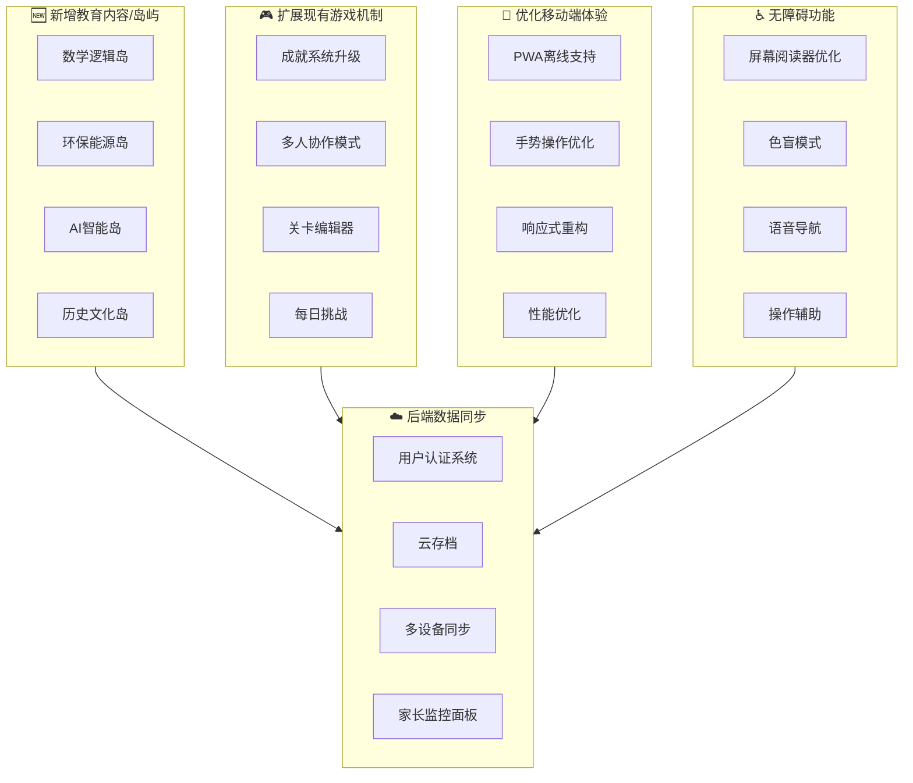
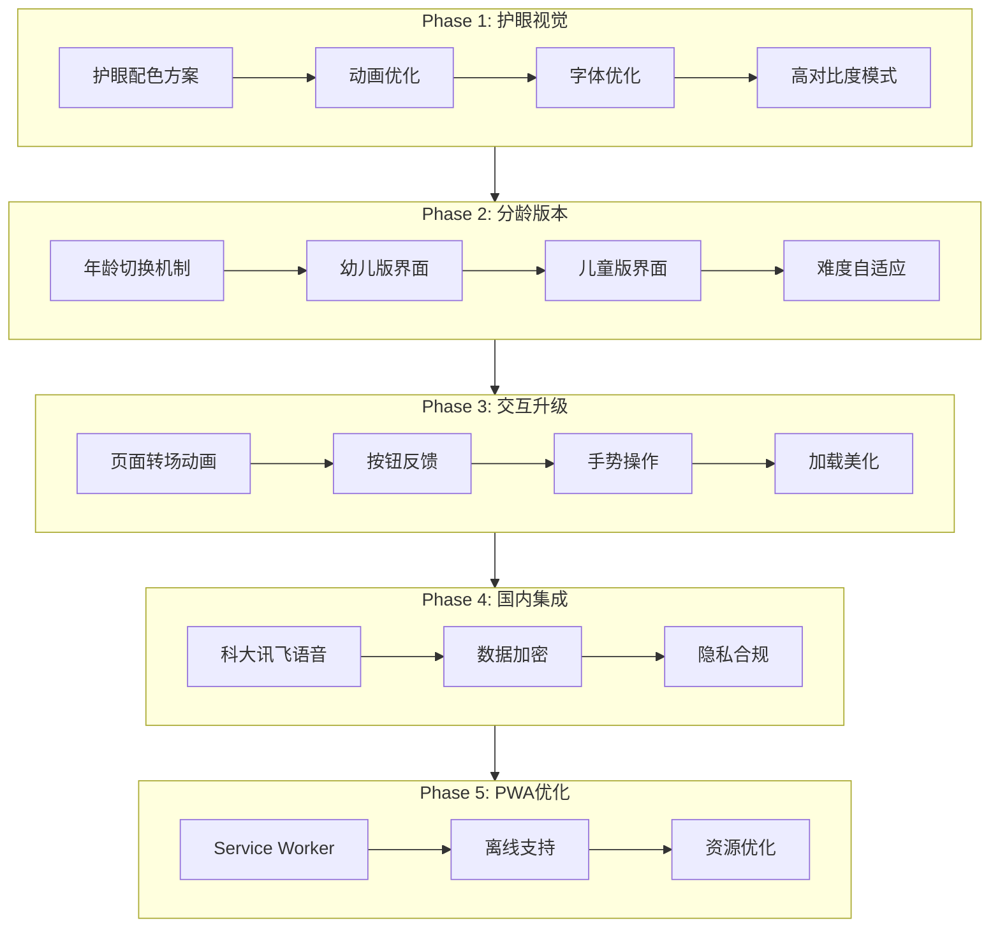

# ddyy的kilo实验台 - 迭代计划

> 项目名称：道闸乐园 (Barrier Buddies Adventure)  
> 创建时间：2026-03-03  
> 状态：📋 规划中

---

## 🎯 项目愿景

将道闸乐园打造为一个**可持续迭代、多平台适配、数据可同步**的儿童STEM教育平台，以道闸为主题载体，融合科学、工程、语言、艺术等跨学科内容。

---

## 📊 迭代维度概览



---

## 🗓️ 迭代阶段规划

### Phase 1: 基础优化 (第1-2周)
**目标**：夯实基础，提升现有体验

| 优先级 | 任务 | 状态 | 预估工时 |
|--------|------|------|----------|
| P0 | 移动端响应式全面优化 | 🔲 待开始 | 3天 |
| P0 | PWA离线支持实现 | 🔲 待开始 | 2天 |
| P1 | 性能优化（图片懒加载、代码分割） | 🔲 待开始 | 2天 |
| P1 | 现有Bug修复 | 🔲 待开始 | 1天 |

### Phase 2: 内容扩展 (第3-4周)
**目标**：丰富教育内容，新增2个岛屿

| 优先级 | 任务 | 状态 | 预估工时 |
|--------|------|------|----------|
| P0 | 数学逻辑岛设计与开发 | 🔲 待开始 | 4天 |
| P0 | 环保能源岛设计与开发 | 🔲 待开始 | 4天 |
| P1 | 现有岛屿内容扩充 | 🔲 待开始 | 2天 |

### Phase 3: 功能增强 (第5-6周)
**目标**：游戏机制升级，提升用户粘性

| 优先级 | 任务 | 状态 | 预估工时 |
|--------|------|------|----------|
| P0 | 成就系统2.0（徽章系统重构） | 🔲 待开始 | 3天 |
| P1 | 每日挑战系统 | 🔲 待开始 | 2天 |
| P1 | 进度云备份（本地优先） | 🔲 待开始 | 2天 |

### Phase 4: 无障碍优化 (第7周)
**目标**：全面支持无障碍访问

| 优先级 | 任务 | 状态 | 预估工时 |
|--------|------|------|----------|
| P0 | 屏幕阅读器ARIA优化 | 🔲 待开始 | 2天 |
| P0 | 色盲友好模式 | 🔲 待开始 | 2天 |
| P1 | 语音导航增强 | 🔲 待开始 | 1天 |

### Phase 5: 后端集成 (第8-10周)
**目标**：实现数据云端同步

| 优先级 | 任务 | 状态 | 预估工时 |
|--------|------|------|----------|
| P0 | 后端API设计（Firebase/Supabase） | 🔲 待开始 | 3天 |
| P0 | 用户认证系统 | 🔲 待开始 | 2天 |
| P1 | 多设备数据同步 | 🔲 待开始 | 3天 |
| P1 | 家长监控面板（Web） | 🔲 待开始 | 2天 |

---

## 📋 详细任务清单

### 维度1：新增教育内容/岛屿

#### 🧮 数学逻辑岛 (MathLogic Island)
**主题**：数学思维 + 逻辑推理
**目标年龄**：5-8岁

**游戏模块**：
1. **道闸计数器** - 数经过的车辆数量，学习加减法
2. **模式识别** - 识别道闸开关的规律模式
3. **空间推理** - 规划停车场车辆停放位置
4. **时间计算** - 计算道闸升降需要的时间

**技术实现**：
```typescript
// src/pages/MathPage.tsx
interface MathGame {
  type: 'counting' | 'pattern' | 'spatial' | 'time';
  difficulty: 1 | 2 | 3;
  reward: { stars: number; badge?: string };
}
```

#### 🌱 环保能源岛 (EcoEnergy Island)
**主题**：环保意识 + 能源知识
**目标年龄**：6-10岁

**游戏模块**：
1. **太阳能实验** - 模拟太阳能板给道闸供电
2. **节能对比** - 比较不同道闸的能耗
3. **材料分类** - 学习道闸材料的回收分类
4. **碳足迹计算** - 简单了解环保概念

#### 🤖 AI智能岛 (AI Smart Island) - Phase 3
**主题**：人工智能启蒙
**目标年龄**：8-12岁

**游戏模块**：
1. **车牌识别** - 了解OCR图像识别
2. **语音控制** - 用语音命令控制道闸
3. **行为预测** - 预测车辆到达时间
4. **简单训练** - 训练模型识别不同车型

#### 🏛️ 历史文化岛 (History Island) - Phase 3
**主题**：道闸发展史 + 文化差异
**目标年龄**：7-12岁

---

### 维度2：扩展现有游戏机制

#### 🏆 成就系统2.0

**徽章分类**：
```typescript
interface BadgeSystem {
  // 探索类
  explorer: ['世界旅行者', '岛屿发现者', '秘密寻找者'];
  // 学习类
  learner: ['词汇大师', '科学小博士', '数学天才'];
  // 技能类
  skill: ['建造专家', '安全卫士', '艺术家'];
  // 坚持类
  persistence: ['每日打卡', '连续7天', '连续30天'];
  // 社交类
  social: ['分享达人', '互助之星'];
}
```

**等级系统**：
- 小闸闸学徒 → 道闸小助手 → 道闸工程师 → 道闸大师 → 道闸传奇

#### 📅 每日挑战系统

**功能设计**：
- 每日3个不同难度的挑战任务
- 连续完成获得额外奖励
- 挑战类型轮换：数学/语言/科学/艺术

#### 🎨 关卡编辑器 (V2.0规划)
**功能**：允许儿童设计自己的道闸关卡

---

### 维度3：优化移动端体验

#### PWA离线支持

**实现清单**：
- [ ] Service Worker配置
- [ ] 离线页面缓存策略
- [ ] 资源预加载
- [ ] 后台同步队列

```typescript
// vite.config.ts 添加
import { VitePWA } from 'vite-plugin-pwa';

VitePWA({
  registerType: 'autoUpdate',
  workbox: {
    globPatterns: ['**/*.{js,css,html,ico,png,svg}'],
    runtimeCaching: [
      {
        urlPattern: /^https:\/\/fonts\.googleapis\.com\/.*/i,
        handler: 'CacheFirst',
      },
    ],
  },
});
```

#### 手势操作优化

| 手势 | 功能 |
|------|------|
| 左滑 | 返回上一页 |
| 右滑 | 进入下一页/下一步 |
| 双指缩放 | 放大/缩小场景 |
| 长按 | 显示提示/帮助 |
| 摇晃 | 重置当前游戏 |

#### 响应式重构重点

**断点设计**：
```css
/* 小手机 */
@media (max-width: 375px) { }
/* 标准手机 */
@media (min-width: 376px) and (max-width: 428px) { }
/* 大手机/小平板 */
@media (min-width: 429px) and (max-width: 768px) { }
/* 平板 */
@media (min-width: 769px) and (max-width: 1024px) { }
/* 桌面 */
@media (min-width: 1025px) { }
```

---

### 维度4：添加更多无障碍功能

#### ARIA优化清单

| 组件 | ARIA属性 | 说明 |
|------|----------|------|
| 按钮 | `aria-label`, `aria-pressed` | 明确按钮功能 |
| 导航 | `role="navigation"`, `aria-current` | 当前位置 |
| 进度 | `role="progressbar"`, `aria-valuenow` | 进度指示 |
| 弹窗 | `role="dialog"`, `aria-modal` | 模态对话框 |
| 游戏区域 | `role="application"` | 交互式游戏区 |

#### 色盲友好模式

**支持类型**：
- 红绿色盲 (Protanopia/Deuteranopia)
- 蓝黄色盲 (Tritanopia)
- 全色盲 (Achromatopsia)

**实现方案**：
```typescript
// 使用图案+颜色双重编码
const colorBlindPatterns = {
  success: { color: 'green', pattern: 'checkered' },
  error: { color: 'red', pattern: 'diagonal-lines' },
  warning: { color: 'yellow', pattern: 'dots' },
};
```

#### 语音导航增强

**功能**：
- 全程语音引导操作
- 语音播报当前位置
- 语音确认操作结果
- 支持语音命令（简单指令）

---

### 维度5：集成后端数据同步

#### 技术选型对比

| 方案 | 优点 | 缺点 | 适用场景 |
|------|------|------|----------|
| **Firebase** | 快速集成，实时同步，免费额度大 | 数据在中国访问慢 | 国际版 |
| **Supabase** | 开源，PostgreSQL，中国访问好 | 需要自己部署 | 国内版 |
| **LeanCloud** | 国内服务，文档中文，合规 | 收费较高 | 国内首选 |
| **自建API** | 完全控制，无依赖 | 运维成本高 | 长期方案 |

**推荐方案**：
- **短期**：Firebase (国际版) + 本地缓存降级
- **长期**：Supabase 或 自建后端

#### 数据结构规划

```typescript
// 用户数据
interface UserData {
  uid: string;
  email?: string;
  createdAt: string;
  lastLoginAt: string;
  profiles: ChildProfile[];
  settings: GlobalSettings;
}

// 同步队列
interface SyncQueue {
  id: string;
  operation: 'create' | 'update' | 'delete';
  entity: 'profile' | 'progress' | 'settings';
  data: unknown;
  timestamp: number;
  retryCount: number;
}
```

#### 家长监控面板功能

**Web端功能**：
- 多孩子进度总览
- 学习时长统计图表
- 每日/周/月报告
- 成就解锁记录
- 内容过滤设置

---

## 📈 进度追踪

### 当前状态：Phase 2 - 分龄版本系统（核心架构完成）

| 维度 | 完成度 | 状态 |
|------|--------|------|
| 护眼视觉系统 | 100% | ✅ 已完成 |
| 分龄版本 | 60% | 🔨 核心架构完成 |
| 交互体验 | 0% | 📋 待开始 |
| 国内服务集成 | 0% | 📋 待开始 |
| PWA优化 | 0% | 📋 待开始 |

### 实施路线图（更新版）



### 更新日志

| 日期 | 更新内容 | 版本 |
|------|----------|------|
| 2026-03-03 | 创建初始计划文档 | v0.1 |
| 2026-03-03 | 确认需求：分龄+国内+护眼+免费 | v0.2 |

---

## ✅ 需求确认（2026-03-03更新）

### 已确认项

| 项目 | 决策 | 说明 |
|------|------|------|
| **目标用户** | 分龄版本 | 幼儿版(3-6) + 儿童版(7-10)，可切换 |
| **地域合规** | 国内优先 | 数据存储国内，语音使用科大讯飞/百度 |
| **商业化** | 完全免费 | 个人使用免费，无广告 |
| **核心目标** | 视觉优化 | 护眼配色、流畅动画、精致交互 |

### 护眼设计原则

```css
/* 色彩规范 - 护眼模式 */
--background: 45 30% 96%;      /* 暖白背景，减少蓝光 */
--foreground: 30 20% 25%;      /* 柔和深色文字 */
--primary: 170 40% 45%;        /* 墨绿主色，舒缓 */
--accent: 35 80% 55%;          /* 暖黄强调，不刺眼 */

/* 字体规范 */
font-family: 'Noto Sans SC', 'PingFang SC', sans-serif;
font-size-min: 16px;           /* 最小16px，保护视力 */
line-height: 1.6;              /* 宽松行距 */

/* 动画规范 */
animation-duration: 0.3s;      /* 快速响应，减少等待 */
prefers-reduced-motion: 支持; /* 尊重用户偏好 */
```

---

## 🤝 协作说明

1. **每次迭代前**：更新本计划，确认优先级
2. **开发过程中**：记录遇到的问题和决策
3. **迭代完成后**：更新进度和反思
4. **版本标记**：使用语义化版本 v1.0.0

---

## 📮 待讨论问题（已解决）

✅ **目标用户群体**：分龄版本 - 幼儿版(3-6) + 儿童版(7-10)  
✅ **地域定位**：国内市场优先，数据合规  
✅ **商业化模式**：完全免费，无广告，个人用途  
✅ **核心优先级**：护眼视觉 + 流畅交互  

**待补充**：
- AI功能深度：是否需要接入大模型？（建议：V2再考虑）
- 多端需求：是否需要小程序版本？（建议：先优化H5+PWA）
